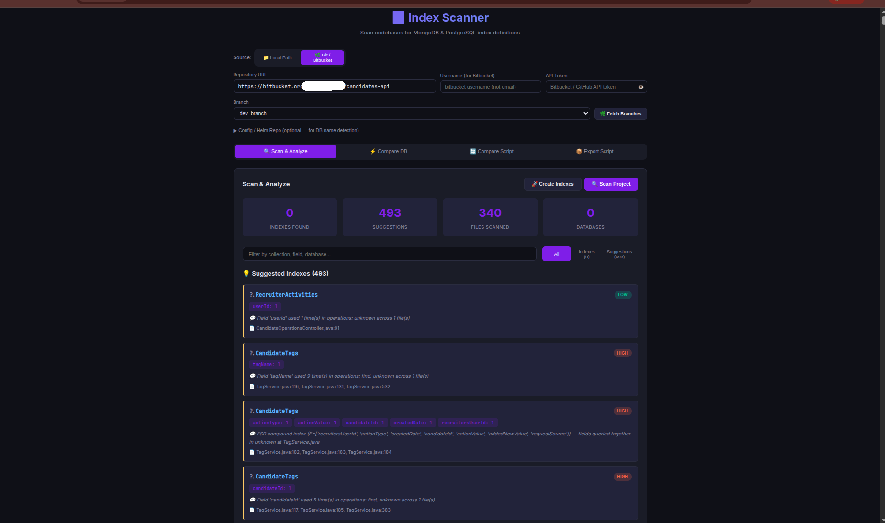
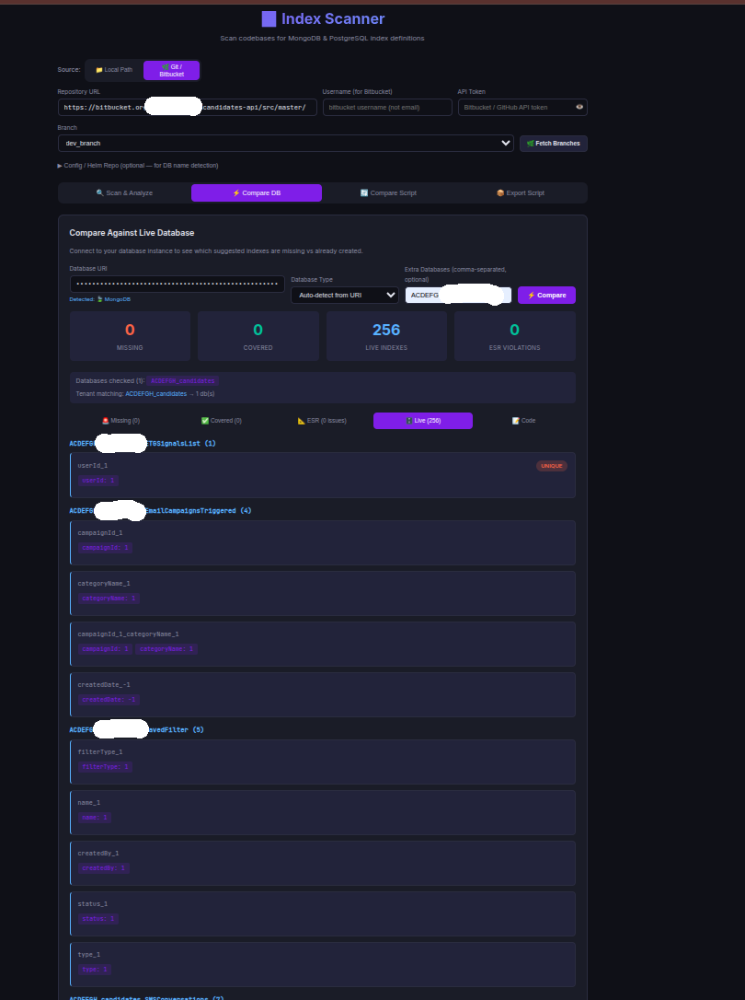
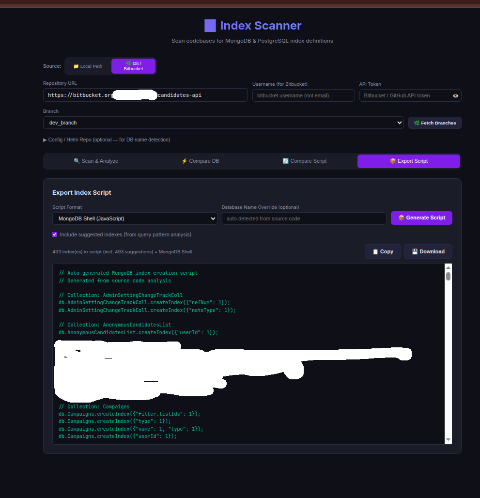

# MongoDB Index Scanner (MCP)


> **Find the indexes your code needs — and the ones it never asked for — before they reach production.**

A static analysis tool and **Model Context Protocol (MCP) server** that scans source code for database index definitions and query patterns, then tells you which indexes are declared, which are missing, and which are risky. It ships as a CLI, a Python library, a web UI, and an MCP server your AI assistant can call directly.

Supports **Java, Kotlin, Python, JavaScript, TypeScript, SQL**, and config files (XML, YAML, JSON, properties).

---

## Why This Exists

Missing indexes are almost never a competence problem. In practice there are two
very human reasons a query ships without one:

**1. It was overlooked.** The developer added a new query filter in the third file
of a twelve-file change. Creating the index is a separate step, in a separate
system, and it simply did not make it onto the checklist. Code review does not
catch it either, because a reviewer reading a diff has no way to know whether
`findByTenantIdAndStatus` is already backed by an index in production.

**2. Nobody was sure which index to add.** The developer knows the query needs
support but not whether it should be `{tenantId: 1}`, `{tenantId: 1, status: 1}`,
or `{status: 1, tenantId: 1}` — and column order is exactly what decides whether
the index gets used at all. Faced with that uncertainty, the safe move is to defer
it. Deferred usually means forgotten.

Then the usual sequence plays out:

1. Code ships with a query that has no supporting index
2. It works fine on a 10k-document dev collection
3. Six months later that collection has 40M documents and the query is a full scan
4. Now you are adding an index to a hot production collection under pressure

The information needed to prevent all of this is **already in the source code**:
the `@Indexed` annotations, the `createIndex()` calls, the `.find()` filters, the
`.sort()` fields. Nobody reads it systematically because nobody has time to audit
every repo by hand.

This tool reads it for you, and it answers the second question too. It does not
just say "you need an index here" — it proposes the specific field set and column
order, ranked by priority, using Equality → Sort → Range ordering.

**Shift-left for database performance.** Catch the missing index at review time,
not at 3 AM.

---

## What It Does

```
Source code ──▶ Parse annotations ──▶ Declared indexes
            ├──▶ Analyze queries    ──▶ Suggested indexes (with priority)
            ├──▶ Scan SQL/DDL       ──▶ Risky migrations, schema anti-patterns
            ├──▶ Compare            ──▶ vs live DB nodes / CI-CD scripts = real gaps
            └──▶ Generate           ──▶ mongo shell / pymongo / SQL scripts + JSON
```

Three questions it answers:

| Question | How |
|----------|-----|
| *What indexes does this codebase declare?* | Parses Spring Data annotations, programmatic `createIndex()`, JPA, SQL DDL, Elasticsearch |
| *What indexes does it actually need?* | Analyzes `.find()` / `.aggregate()` / `.updateOne()` filter + sort fields, suggests single-field and compound indexes with priority |
| *Which of those are actually missing?* | Diffs the suggestions against live database nodes and against your CI/CD index scripts, so only real gaps are reported |
| *Is anything unsafe?* | PostgreSQL guardrails: destructive DDL, non-concurrent index builds, missing FK indexes, `SELECT *`, cartesian joins, SQL injection patterns |

---

## The Workflow It Is Built For

The tool is designed around one specific moment: **you are on a feature branch and
about to merge to main.** Before that merge, you want to know whether the queries
you just wrote have index support in the databases they will actually run against.

```
feature branch  ──scan──▶  suggested indexes
                              │
                              ├──compare──▶  live database nodes
                              │              (what indexes exist right now?)
                              │
                              └──compare──▶  CI/CD index scripts
                                             (what will the pipeline create?)
                                                      │
                                                      ▼
                                            only the genuine gaps
```

Point it at any branch of a repo and it scans that branch specifically, so you see
the index requirements introduced by *your* change rather than a full-history audit.

Then it diffs those requirements two ways:

- **Against live database nodes.** Connect a MongoDB or PostgreSQL URI and the tool
  reads the indexes that exist right now, so the output is only what is genuinely
  missing rather than a wall of theoretical suggestions. It expands tenant-prefixed
  databases automatically, so one code-level collection name like `candidates` is
  checked across every `{tenant}_candidates` database on the cluster.
- **Against your CI/CD index scripts.** If your pipeline already ships index
  creation scripts, point the tool at them and it reports what the code needs but
  the script does not create — the gap that would otherwise reach production
  silently.

Anything the live database or the pipeline script already covers is filtered out.
What is left is the actionable list.

---

## Screenshots

**Scan a branch — declared indexes and prioritized suggestions**



**Compare against a live database — see only what is genuinely missing**



**Export as a runnable script — mongo shell, pymongo, or PostgreSQL SQL**



---

## Four Ways to Use It

### 1. MCP Server — your AI assistant calls it

This is the most interesting mode. Register it once and your AI client (Claude, Cursor, Kiro, ...) can analyze index coverage on demand while you are reviewing code.

```json
{
  "mcpServers": {
    "index-scanner": {
      "command": "index-scanner-mcp",
      "args": ["serve"],
      "disabled": false
    }
  }
}
```

Then just ask: *"Does this service have the indexes it needs?"*

### 2. CLI — in CI or on your laptop

```bash
index-scanner-mcp scan    /path/to/project
index-scanner-mcp suggest /path/to/project
index-scanner-mcp export  /path/to/project --format mongo_shell --db-name mydb
```

### 3. Python library

```python
from index_scanner_mcp import ScannerEngine, ScriptGenerator

result = ScannerEngine().scan_project("/path/to/project")
print(f"{len(result.indexes)} declared, {len(result.suggestions)} suggested")
print(ScriptGenerator().generate_mongo_shell(result.indexes, db_name="mydb"))
```

### 4. Web UI

A React + Flask UI for scanning, comparing, and exporting without touching a terminal. See [`ui/README.md`](ui/README.md).

---

## Installation

```bash
git clone https://github.com/saitejavarmak/mongodb_index_scanner.git
cd mongodb_index_scanner
pip install .

# development (editable + test deps)
pip install -e ".[dev]"

# PostgreSQL guardrails extras
pip install -e ".[aurora]"
```

Docker:

```bash
docker build -t index-scanner-mcp .
docker run --rm -v /path/to/project:/project index-scanner-mcp scan /project
```

---

## CLI Reference

| Command | Purpose |
|---------|---------|
| `scan <path> [--format table\|json]` | Discover all declared index definitions |
| `suggest <path> [--format table\|json]` | Suggest indexes from query pattern analysis |
| `export <path> --format mongo_shell\|pymongo [--db-name N] [--output F]` | Generate an executable index-creation script |
| `serve [--transport stdio\|sse] [--port P]` | Start the MCP server |
| `pg-guardrails <path>` | Run the PostgreSQL safety analyzers |

---

## MCP Tools

| Tool | Description |
|------|-------------|
| `scan_indexes` | Scan a project for all database index definitions |
| `scan_multiple_projects` | Scan several project directories and merge the report |
| `search_indexes` | Filter index results by keyword (field name, `unique`, `compound`, ...) |
| `export_index_report` | Write a structured JSON report to disk |
| `suggest_indexes` | Suggest indexes based on observed query patterns |
| `suggest_indexes_report` | Export the suggestions as JSON |
| `scan_and_export` | Scan and emit a ready-to-run creation script |
| `pg_scan_migrations` | Flag risky/destructive SQL migrations |
| `pg_scan_schema` | Detect schema anti-patterns and constraint gaps |
| `pg_scan_indexes` | Find duplicate, overlapping, and missing FK indexes |
| `pg_scan_performance` | Flag query anti-patterns |
| `pg_scan_application_code` | Detect unsafe DB access (SQL injection risk, `SELECT *`) |
| `pg_full_scan` | Run every PostgreSQL analyzer and return a gate decision |
| `scan_team` | Scan every service owned by a team via the service catalog |
| `list_team_services` | List a team's services and their database types |

---

## What It Detects

### Declared index definitions

- **Spring Data MongoDB** — `@Indexed`, `@CompoundIndex`, `@CompoundIndexes`, `@TextIndexed`, `@GeoSpatialIndexed`, `@HashIndexed`, `@WildcardIndexed`
- **Programmatic** — `createIndex()`, `ensureIndex()`, `IndexOperations`, `IndexModel`
- **JPA / Hibernate** — `@Index`, `@Table(indexes = ...)`
- **SQL** — `CREATE INDEX`, `CREATE UNIQUE INDEX`
- **Elasticsearch** — `CreateIndexRequest`
- **pymongo** — `create_index()`, `ensure_index()`

### Query patterns (drives suggestions)

- `BasicDBObject`, `Document`, `Filters.*` query construction
- `.find()`, `.aggregate()`, `.updateOne()`, `.deleteMany()` operations
- Sort fields via `Sorts.*` and `.sort()`
- Java constant references (auto-resolved, so `AppConstants.FIELD_NAME` becomes the real field)
- Python / JS `collection.find({...})` patterns

### Supported file types

| Category | Extensions |
|----------|-----------|
| Java / Kotlin | `.java`, `.kt` |
| Python | `.py` |
| JavaScript / TypeScript | `.js`, `.ts` |
| Config / DDL | `.sql`, `.xml`, `.yml`, `.yaml`, `.json`, `.properties` |

---

## PostgreSQL Guardrails

Beyond MongoDB, the tool ships analyzers that gate risky PostgreSQL changes in CI:

| Analyzer | Catches |
|----------|---------|
| Migrations | `DROP TABLE/COLUMN`, `TRUNCATE`, `VACUUM FULL`, non-concurrent `CREATE INDEX`, missing rollback scripts |
| Schema | Missing primary keys, missing foreign keys, circular refs, `JSON` vs `JSONB`, `TIMESTAMP` without time zone, `SERIAL` vs `IDENTITY` |
| Indexes | Duplicate indexes, prefix/overlapping indexes, unindexed foreign keys, wrong column order, naming violations |
| Performance | `SELECT *`, `DELETE`/`UPDATE` without `WHERE`, leading-wildcard `LIKE`, `ORDER BY RANDOM()`, cartesian joins, functions on indexed columns |
| Application code | `Statement` usage (SQL injection risk), string-concatenated SQL |

```bash
pg-guardrails /path/to/project          # full scan with pass/fail gate decision
```

Thresholds and rule severities are configurable via `.guardrails.yml`.

---

## Team-Wide Scanning

Instead of scanning one repo at a time, point the scanner at a **team** and let it
discover that team's services itself.

This needs a **service catalog** — a CSV mapping services to teams, languages, and
database types. It is organization-specific, so it is not shipped:

```bash
cp service_catalog/service_catalog.csv.example service_catalog/service_catalog.csv
# fill in your services, then:
index-scanner-mcp serve   # and ask your AI client to "scan team analytics"
```

See [`service_catalog/README.md`](service_catalog/README.md) for the column reference
and repo-name derivation rules.

---

## Development

```bash
pip install -e ".[dev]"
pytest            # 326 tests
```

### Project structure

```
mongodb_index_scanner/
├── src/index_scanner_mcp/
│   ├── server.py             # MCP server (tool definitions)
│   ├── cli.py                # CLI entry point
│   ├── scanner_engine.py     # Core orchestrator
│   ├── annotation_parser.py  # Spring Data annotation extraction
│   ├── query_analyzer.py     # Query pattern analysis → suggestions
│   ├── constant_resolver.py  # Resolves Java constant references
│   ├── file_discovery.py     # Multi-language file walker
│   ├── script_generator.py   # mongo_shell / pymongo output
│   ├── report_generator.py   # JSON reports
│   └── pg/                   # PostgreSQL guardrail analyzers
├── ui/                       # React + Flask web UI
├── service_catalog/          # Catalog template + docs (yours is gitignored)
├── k8s/                      # Kubernetes deployment manifest
└── tests/                    # 326 tests
```

---

## Built With AI

This tool was designed and built using AI as a development partner.

The **domain knowledge** came from database operations experience: which annotations
actually create indexes, why a leading-wildcard `LIKE` can't use one, why
`CREATE INDEX` without `CONCURRENTLY` locks writes, which query shapes need a
compound index and in what column order.

The **implementation** — parsers, the MCP server, the analyzers, the React UI, 326
tests — was AI-generated and then iterated against real repositories until the
false-positive rate was low enough to trust in CI.

That combination is the point: operational expertise turned into tooling that
would otherwise never have been built, at a speed a single engineer could sustain.

---

## Contributing

Fork → branch → change → `pytest` → pull request.

---

## License

[MIT](LICENSE) © 2024-2026 Sai Teja Varma Kantam
